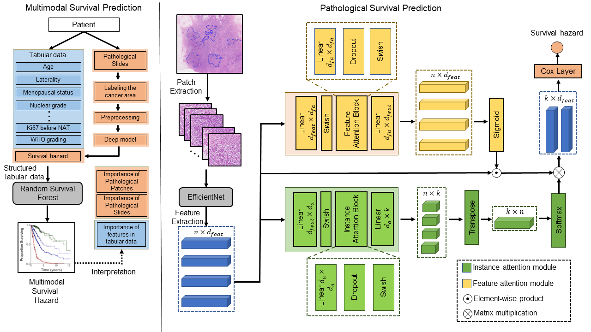

# Code for Multimodal Survival Analysis

# Framework

## Requirment

* python==3.7.0
* lifelines       0.26.4
* matplotlib      3.5.1
* numexpr         2.8.1
* numpy           1.21.5
* pandas          1.1.5
* Pillow          8.4.0
* pyparsing       3.0.6
* python-dateutil 2.8.2
* scikit-learn    0.24.2
* scikit-survival 0.16.0
* scipy           1.7.3
* setuptools      58.0.4
* six             1.16.0
* threadpoolctl   3.0.0
* xlrd            1.2.0
* Pytorch
* R

## Usage

In the Pathology folder is the code required for pathological modal survival analysis training and analysis, and in the Multimodal folder is the code required to use the multimodal method. In the Analysis folder is the code needed to analyze and organize the experimental data. There is a corresponding simple code description under each folder.

## Dataset

The dataset supporting the conclusions of this article is upon request with the institutions’ IRB policies. All requests for access to in-house data will be addressed to the corresponding authors, Pro. Jianhua Yao (jianhuayao@tencent.com) or Pro. Hong Bu (hongbu@scu.edu.cn), and will be processed in accordance with the institutional guidelines of West China Hospital, Sichuan University. And they will assess all requests based on the purpose of data request, and it may take up to one month to process the request. A material-transfer or data-usage agreement will be required between West China Hospital and the receiving organization. The requesting organization must provide comprehensive details, including the name and full contact information of the individual and institution making the request, along with specific identification of the data being requested. Additionally, the requesting organization must clearly state the intended purpose of the data transfer and provide assurances that the transferred data will only be used for non-commercial academic and educational purposes in compliance.

## Disclaimer

This is not an official Tencent product.

## Coypright

This tool is developed in Tencent AI Lab.

The copyright holder for this project is Tencent AI Lab.

All rights reserved.